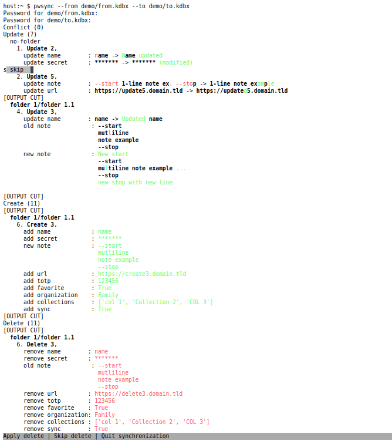

# A Password synchronization tool

<p align="center">
<a href="https://github.com/aptly-io/pwsync/actions"></a>
</p>


> Nobody can be held liable for any damages cause by this tool.
> Always make a backup before using this tool.

_pwsync_ is a low level command line tool that synchronizes _password databases_.

`pwsync` grew from a personal need to simplify credential usage for online services
(e.g. for web shops, banks, cloud services, ...) 
on different platforms (Ubuntu, iPad, Android mobile, ...).
Keepass is outdated for these use-cases. 
Bitwarden (and alikes) simplify authentication thanks to its
[browser extension](https://bitwarden.com/help/article/getting-started-browserext/).
Due to the personal use case, `pwsync` only supports 
[_Keepass_](https://keepass.info/) database files
and [_Bitwarden_](https://bitwarden.com/) online database.
But anybody can add support for other cloud password services 
if their (public) REST API is known.

These properties of the password database features are handled (the _lowest common denominator_):

- a hierarchical classification _folder_/_group_
- a credential's _title_/description
- a _username_ (an empty username is not supported)
- a _password_
- (per credential) _notes_
- one _url_ (without matching capabilities of Bitwarden)
- a one time pass code (_TOTP_ which Keepass stores in its _attributes_ property as _pws_totp_)
- a _favorite_ flag (Keepass stores this in its attributes property as _pws_fav_)
- an organization (required when using collections, which Keepass stores as _pws_org_ in its attributes property)
- multiple collections (which Keepass keeps in its attributes property as _pws_col_)
- a specific _sync_ flag that, if missing, will ignore a password database entry during synchronization
  (Keepass keeps this in its attributes property as _pws_sync_)

Support for fields, icons, expiration date, the automatic creation of organizations,
changes on a credential's collection set, Bitwarden's reprompt, 
Bitwarden's multiple urls and matching patterns, privately hosted Bitwarden etc. _is missing_!

## Usage

> It is important to familarize oneself with `pwsync` first!
> Use the toy Keepass password database files in the `demo` directory (passphrase is `pw`).
> Read this documentation to its very end.

```bash
# main use-case: synchronize changes from a local Keepass database to an online Bitwarden database.
# for all entries that have their _pws_sync_ flag set.
pwsync --from demo/from.kdbx --to bitwarden

# Similar but use the 2 toy Keepass password database files
# make a backup into a "to.kdbx.backup" first!
# see below for an example of typical output.
pwsync --from demo/from.kdbx --to demo/to.kdbx

# a description of all options
pwsync -h
```

## Installation

`pwsync` depends on the [_Bitwarden command line client_](https://bitwarden.com/help/article/cli/) tool.
This tool and its installation description can be found
[here](https://bitwarden.com/help/article/cli/#download-and-install).

```bash
# get git, python (here version 3.8) and build tools
sudo apt install -y --upgrade git build-essential python3.8-venv python3.8-dev

# clone the pwsync repo locally
git clone https://github.com/aptly-io/pwsync.git
cd pwsync

# prepare a virtual env. to avoid conflicts with existing python installation(s)
python3.8 -m venv .venv
. .venv/bin/activate

# upgrade pip and setuptools
python -m pip install --upgrade pip setuptools build
```

### As user

Install the script and try-out the installation with the command command shown in Usage.

```bash
python3 -m pip install .
```

### As developer

```bash
# use an "editable" install together with tools for source code formatting, linting and testing
python -m pip install -e .[dev]

# and/or with tools for building a distribution
python -m pip install .[build]
```

### Development

```bash
# format the source code (configuration in pyproject.toml)
python -m black pwsync/*.py tests/*.py

# linting and source code analysis
python -m pylint pwsync tests || echo "FAILED"
python -m pylama pwsync/*.py

# tests with an xml coverage report for pwsync 
# the test_bwc requires an online account; provide the credentials in env. vars.
export TEST_BW_USERNAME=...
export TEST_BW_PASSWORD=...
python -m pytest -s -vvv --cov=pwsync --cov-report=xml:cov.xml tests || echo "FAILED"

# for distribution
# for the proper version to be generated, use the main branch with a tag like v0.1b5
python -m build

# upload on testpypi
twine check dist/* # basic check

# do a minimal test of the package in a new venv
deactivate
python3.7 -m venv .venv_install_check
. .venv_install_check/bin/activate
python3.7 -m pip install dist/pwsync-0.1b5-py3-none-any.whl
which pwsync
pwsync --from demo/from.kdbx --to demo/to.kdbx
deactivate
rm -rf .venv_install_check

# finally upload
python -m twine upload --repository testpypi dist/*
```

## Technical details

The supported password databases use different technology and implementation:
Keepass is file based while Bitwarden is a cloud service.
To recognize equivalent password entries between the databases,
`pwsync` identifies entries by certain property value(s).
By default the _folder_ and _title_ property values are used.
(this can be customized with the `--id` command line option).

The synchronization goes in 1 direction:
only the `to` database could get modified due to differences with the `from` database.
There are 3 modification types:
- create: adds a new password entry in the `to` database because it exists only in the `from` database.
- delete: removes an entry from the `to` database because it does not exist in the `from` database.
- update: changes an entry in the `to` database because it is different for the equivalent entry in the `from` database.

A _conflict_ is when the `to` password entry has a more recent modification time than
its equivalent entry in the `from` database.
Conflicts are skipped by `pwsync`; one has to manually address these.

> Changing the property value used for password entry identification (e.g. the _title_) in one database,
causes a create/delete modification!

To synchronize, `pwsync` depends on:
- The python [_diffsync_](https://pypi.org/project/diffsync/) module: determines the differences between two password databases.
- The python [_pykeepass_](https://pypi.org/project/pykeepass/) module: modifies a Keepass_ file.
- Bitwarden's official(?) [_command line client_](https://bitwarden.com/help/article/cli/): modifies a Bitwarden online password database.

An curated dump of the console output is shown below:
- The passphrase to open the Keepass file is prompted.
- Since the output would be too large, parts are _cut out_.
- There are no conflicts in this example.
- There are 7 updates (7 entries in `from.kdbx` are different and more recent than `to.kdbx`).
- For easier interpretation, differences are highlighted in red and green.
  - in the first example, the _username_ changed from `name` to `Name updated`.
  - secrets are obviously hidden
- There are 11 new and removed entries (only 1 of each is shown).
  What exactly is added and removed in the entry is show (again in green and red respectively).
  The 1 create and delete entry shown, are very similar; in fact these differ only in their _title_.
  This is the reason `pwsynmc` sees these as different entries (as explained higher)!



## License

`pwsync` is necessarily GPL3 since it (currently) depends upon the GPL3 python module `pykeepass`.

Copyright 2022 Francis Meyvis (pwsync@mikmak.fun)
